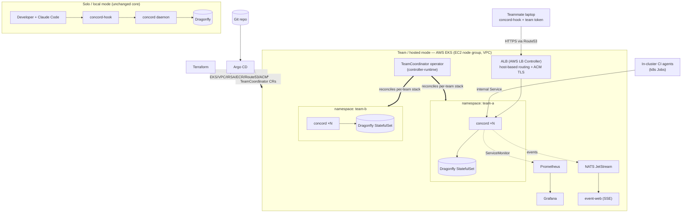

# concord platform — architecture overview (whiteboard / interview brief)

The one-page mental model for the "local → platform" flagship. The detailed,
build-from spec is produced separately (via `/to-spec`); this is the artifact to
study and whiteboard from.

## The 60-second pitch

> concord is a coordination control-plane for concurrent coding agents — it stops
> agents from clobbering each other's edits. It ships in **two modes from one
> codebase**: a **solo/local** mode (a single loopback daemon a developer runs
> with `docker run` — unchanged, fast, ~11 ms), and a **team/hosted** mode where
> the *same guarantee* scales from "agents within my session" to "every agent
> touching my team's repo." Team mode is a **multi-tenant Kubernetes platform**:
> a **`TeamCoordinator` operator** (controller-runtime) provisions an isolated
> concord + data stack per team namespace; clients are both in-cluster CI agents
> and teammates' laptops; it's deployed to **AWS EKS** via **Terraform**, delivered
> by **Argo CD** (teams-as-code), observed with **OpenTelemetry → Prometheus/Grafana**
> plus a live **NATS-JetStream** event feed, and proven under load with **k6 +
> Toxiproxy**.

## Architecture

## Components (what each does)

- **concord daemon** — the coordination service (version check + intent registry). Unchanged logic; team mode adds tenant scoping, auth, and health/readiness probes.
- **`TeamCoordinator` operator** — watches `TeamCoordinator` CRs; reconciles a per-team Deployment (concord ×N) + Dragonfly StatefulSet + Service + NetworkPolicy + ServiceMonitor + Secret; writes status/conditions; handles drift + deletion (finalizer). *This is the controller-runtime centerpiece.*
- **Data** — self-hosted Dragonfly StatefulSet per team (concord uses only basic Redis ops, so ElastiCache/Valkey is a drop-in managed alternative — documented, not default).
- **Ingress** — internal ClusterIP Service for in-cluster CI; opt-in external path via one shared ALB with host-based routing per team (ACM TLS, Route53 DNS).
- **Auth** — operator-issued per-team bearer token (K8s Secret); OIDC-at-ALB is the external hardening path.
- **Observability** — OpenTelemetry in the daemon → Prometheus `/metrics` → Grafana (dashboards as code); domain events → NATS JetStream → event-web live SSE table. Best-effort/async: telemetry never slows or blocks coordination.
- **Delivery** — Argo CD app-of-apps deploys the platform; `TeamCoordinator` CRs live in git (provisioning a team = a PR).
- **Infra** — Terraform provisions EKS + VPC + EC2 node group + IAM/IRSA + ECR + Route53/ACM and bootstraps Argo CD; fully `terraform destroy`-able.
- **Resilience** — k6 load-tests the team service; Toxiproxy injects latency/faults on the concord↔data link to prove graceful degradation and measure its cost.

## Build sequence (each its own spec + PR)

1. **Observability** (specced ✅) — local, immediately useful.
2. **Containerize + Helm** — image → registry; chart for one concord+data.
3. **Team-mode app changes** — tenant scoping, auth, probes.
4. **The operator** — `TeamCoordinator` + controller-runtime, on minikube.
5. **IaC + EKS** — Terraform stands up AWS; deploy the operator.
6. **GitOps** — Argo CD, teams-as-code.
7. **Resilience** — k6 + Toxiproxy.

## Interview tensions → your answers (study these)

- **"concord was a fast local daemon — why is coordination now a remote call?"** → It isn't, for the hot path: in-cluster CI agents co-locate with concord (same VPC, internal Service). Laptop clients are the opt-in edge, and coordination gaps are *seconds* (measured p50 7.6 s), not milliseconds — so network RTT is negligible there. Solo mode stays fully local.
- **"Why an operator instead of a Helm chart per team?"** → Teams are created/destroyed dynamically and need continuous reconciliation, self-healing, drift correction, and status — a control loop, not a one-shot template.
- **"Managed vs self-hosted state?"** → Self-hosted Dragonfly keeps local↔cloud parity and operator ownership; ElastiCache is a documented swap since concord uses only basic Redis ops. A cost/ops-vs-parity trade.
- **"How do you expose a multi-tenant service without a load balancer per tenant?"** → One shared L7 ALB with host-based Ingress routing + per-namespace isolation.
- **"How do tenants authenticate without a shared IdP?"** → Operator-issued per-tenant credentials as K8s Secrets; upgradeable to mTLS or OIDC-at-ALB.
- **"How is telemetry not a reliability risk?"** → Emission is async/best-effort; NATS down ⇒ events dropped + a `events_dropped` counter, and `CheckEdit` is never slowed or blocked. Correctness/latency always win.
- **"What makes this GitOps and not just kubectl?"** → The cluster is a pure function of git: Argo CD app-of-apps + `TeamCoordinator` CRs in git, so provisioning a team is a reviewable PR.

## Non-negotiables carried from the core (don't break these)

Solo/local mode stays a single local binary. The coordination guarantees and the two-layer separation (ADR-0001) are unchanged — team mode scales the *blast radius* of the same guarantee, it does not alter the logic. Reversing ADR-0007's "one daemon per machine, never networked" for team mode is a deliberate, documented decision (a new ADR records it).
